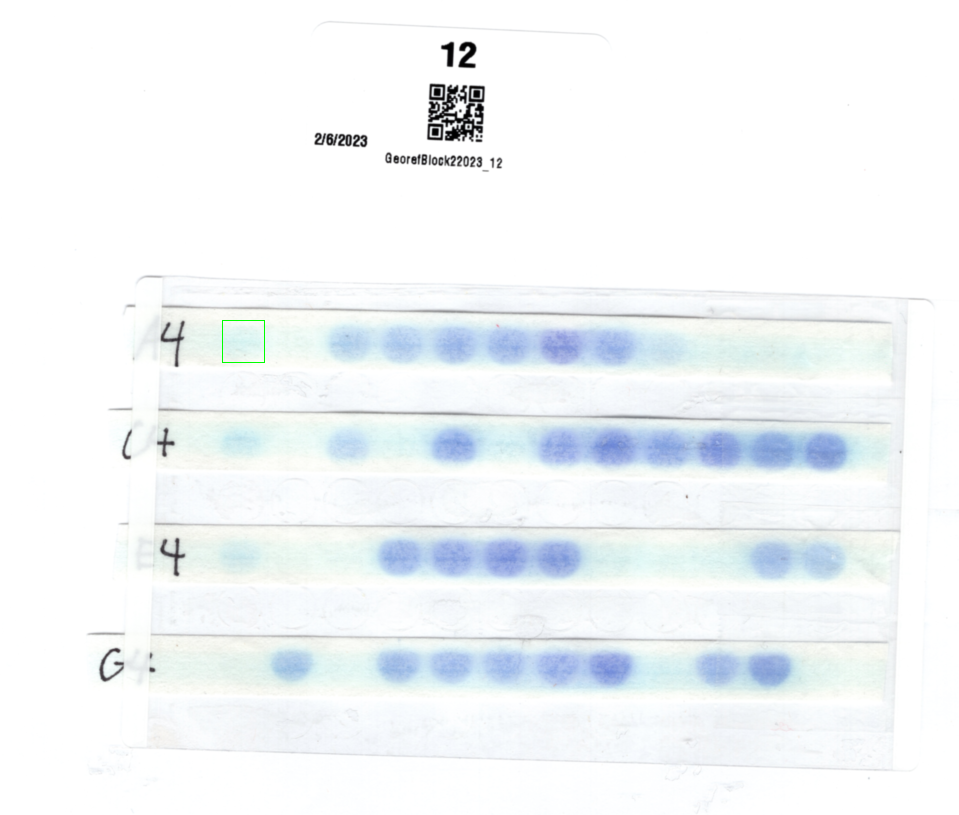
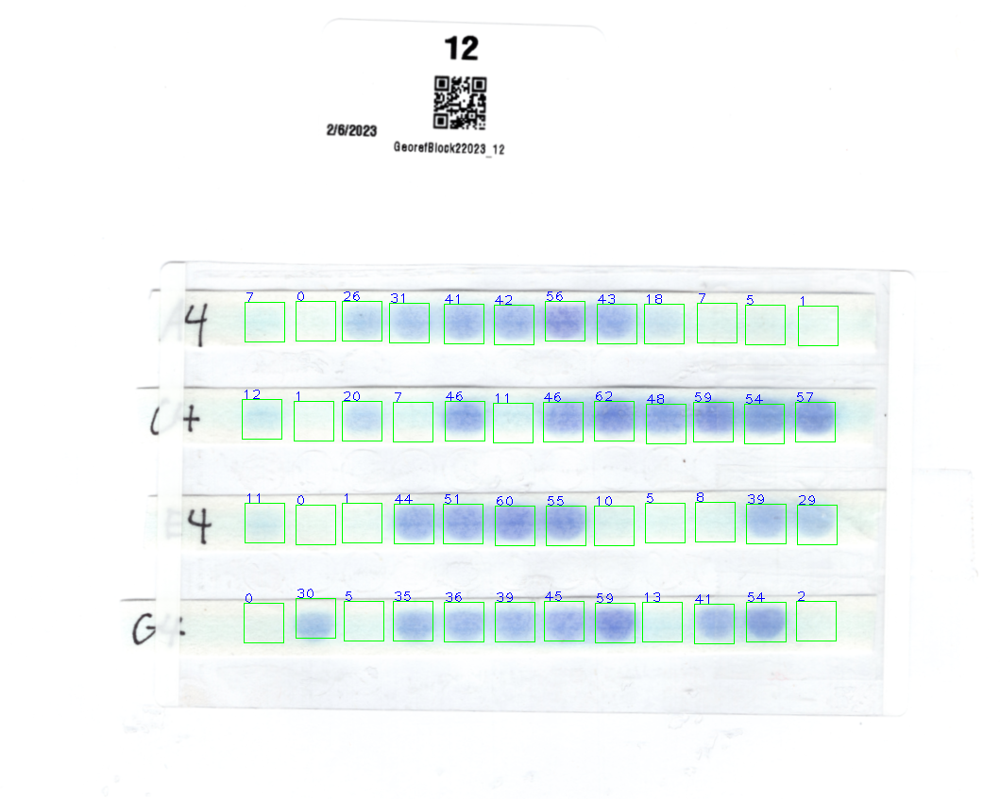

# HCN Phenotyping

## Overview

A python script for measuring the 'blueness' of a circular sample. Users can define a static grid with the ccpa2_grid_define.py script, here the user left-clicks the center on each well from left-to-right, top-to-bottom. This will print a list of coordinates in the console, these can be copied and pasted into the ccpa_grid.py script to be used for bulk measurements. 

The scoring uses LAB thresholding to find dark and blue pixels.

```
python ccpa2_grid.py /full/path/to/example_image
```

## Definer

Renders the user's mouse position, the console prints a list of clicked points.

<p align="center">
	
</p>

## Main script

Renders the static coordinates created by the definer. On left click, the 'blueness' for each well is scored, and the tabular results are copied to the os clipboard. Image can be rotated with 1/2, or cropped with the space button. There is also a circles script that renders/analyzes circles.

<p align="center">
	
</p>


## Example output
```
Pixel Blueness Scoring
10
3
33
38
47
46
64
44
21
10
9
3
17
4
26
10
51
13
48
62
43
53
45
48
16
1
4
53
59
65
58
13
7
11
35
25
1
34
8
44
45
47
54
70
17
44
59
5
```

## Jig
<p align="center">
	
</p>

We developed a 3D printed jig to hold the test strips in place and simplify image analysis. This jig has four components, a base, a mask, and two clamping arms. The base has a small hole in the upper right corner to insert a small piece of filament indicating what should be the A1 corner of the plate. The hinges were designed to use 1.75mm diameter filament as the pin. The STL files contain the separate models and are printable on most 3D printers. The 3MF file was created specifically for Bambu Lab printers with the intention of multi-colored printing to add an additional reference point that can be used for image processing.